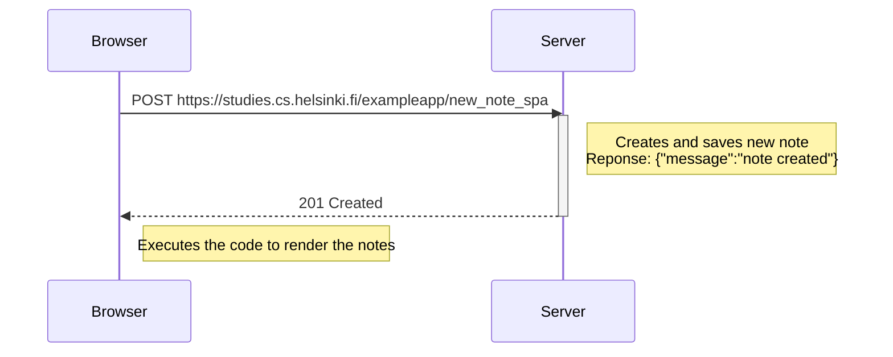

```mermaid
sequenceDiagram
    participant Browser
    participant Server

    Browser->>Server: POST https://studies.cs.helsinki.fi/exampleapp/new_note_spa
    activate Server
    Note right of Server: Creates and saves new note <br /> Reponse: {"message":"note created"}
    Server-->>Browser: 201 Created
    deactivate Server

    Note right of Browser: Executes the code to render the notes
```